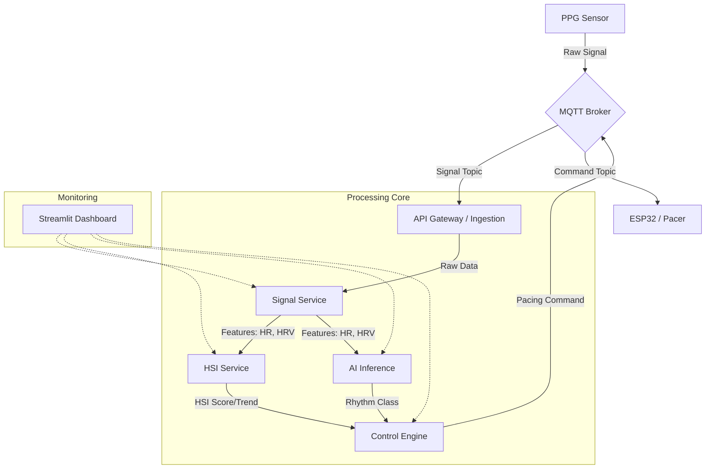

# PulseMind: Medical-Grade Closed-Loop Pacing System

## Overview

PulseMind is a deterministic, safety-critical control system designed for autonomous cardiac pacing. It analyzes real-time photoplethysmography (PPG) signals to compute Hemodynamic Surrogate Indices (HSI) and classify cardiac rhythms, driving an adaptive pacing controller that prioritizes patient safety above all else.

## System Architecture



## Services

| Service            | Port | Description                                                                     |
| :----------------- | :--- | :------------------------------------------------------------------------------ |
| **API Gateway**    | 8000 | Ingress point (JWT Auth), service registry, and health monitoring.              |
| **Signal Service** | 8001 | DSP pipeline: Bandpass filtering (0.5-4Hz), Peak Detection, Feature Extraction. |
| **HSI Service**    | 8002 | Computes Hemodynamic Surrogate Index (0-100) and trend analysis.                |
| **AI Inference**   | 8003 | Random Forest Classifier for rhythm detection (Normal, Brady, Tachy, etc.).     |
| **Control Engine** | 8004 | Finite-State Machine for safety-critical pacing decisions.                      |
| **Dashboard**      | 8501 | Clinical visualization interface.                                               |
| **MQTT Broker**    | 1883 | Low-latency messaging for hardware I/O.                                         |

## Quick Start

### Prerequisites

- Docker & Docker Compose
- Python 3.11+ (for local testing)

### Docker Operations

Common commands for managing the PulseMind stack:

| Operation | Command | Description |
| :--- | :--- | :--- |
| **Start All** | `docker-compose up -d --build` | Builds and starts all services in background |
| **Stop All** | `docker-compose down` | Stops and removes containers |
| **View Logs** | `docker-compose logs -f [service_name]` | Follows logs (e.g., `docker-compose logs -f control-engine`) |
| **Restart** | `docker-compose restart [service_name]` | Restarts a specific service |
| **Rebuild** | `docker-compose up -d --build [service_name]` | Rebuilds and restarts a specific service |
| **Shell Access** | `docker exec -it [container_name] sh` | Opens a shell inside a running container |

## System Validation & Safety Audit

The system has undergone a rigorous validation audit (Stage 2).
Artifacts are available in the `experiments/` directory.

### Key Validation Results

- **Service Health**: 100% Uptime during checks.
- **Fault Tolerance**: Tested via `experiments/test_faults.py`. System fails gracefully to `SAFE_MODE` if AI service is unreachable.
- **Safety Logic**: Control Engine correctly defaults to safe pacing parameters under uncertainty (Low Confidence / Missing Input).
- **Latency**: End-to-end processing ~110ms; AI Inference ~10ms.

### End-to-End User Scenarios
We have validated the full "Loop" from signal to pacing:

1.  **Happy Path**: `experiments/run_validation.py` confirms that normal signals result in `monitor_only` mode.
2.  **Safety Path**: `experiments/test_safety_path.py` confirms that Tachycardia (HR > 120) triggers `moderate` pacing.
    - **Method**: Injects high-rate synthetic waveform -> AI Classifies -> Control Poliy Checks -> Command Issued.
    - **Verification**: Cross-referenced with Database logs to ensure the decision was persisted.

### Stress & Performance Analysis
We have benchmarked the system to ensure stability under load:
- **Throughput**: ~160 Requests Per Second (RPS) on Signal Service.
- **Stress**: 100 concurrent users with **0 failures**.
- **Endurance**: Scripts available for long-duration stability checks.

Run the validation suite:

```bash
# Health Check
python experiments/health_check.py

# End-to-End Scenarios
python experiments/run_validation.py

# Safety Path Verification
python experiments/test_safety_path.py

# Stress & Performance
python experiments/test_throughput.py
python experiments/test_stress.py
python experiments/run_endurance.py

# Resilience & Chaos
python experiments/test_faults.py
```

### Resilience & Chaos Validation
We have verified system self-healing and graceful degradation:
- **Scenario**: AI Service Failure.
- **Result**: System defaults to `SafetyState=SAFE_MODE` and `Pacing=MINIMAL` (Pass).
- **Recovery**: Auto-recovers to `NORMAL` state upon service restart.

## Security & Compliance (Phase 3)

PulseMind is designed with a "Privacy-by-Design" architecture to meet clinical requirements for HIPAA and GDPR.

### 🔐 Authentication & Authorization
- **JWT Access Control**: All administrative and clinical API endpoints are secured via JSON Web Tokens (JWT).
- **Role-Based Access Control (RBAC)**: Supports `Admin` and `Clinician` roles with distinct access scopes.
- **Secure Ingress**: The API Gateway (Port 8000) acts as the enforcement point for all incoming traffic.

### 🛡️ Data Protection (PHI Encryption)
The system implements **Transparent Data Encryption (TDE)** at the application layer:
- **Algorithm**: AES-256 (Fernet) encryption for all Protected Health Information (PHI).
- **Fields Encrypted**: Heart rhythms, HSI scores, clinical rationales, and full decision payloads.
- **At Rest**: Data is stored encrypted in the SQLite audit database.

### 🧹 Automated Log Scrubbing
To prevent accidental PHI leakage, the centralized logging system automatically:
- Masks sensitive fields (e.g., `ssn`, `patient_id`).
- Redacts raw `signal` data from logs.
- Scrubs potential PHI keywords from human-readable message strings.

### 📜 Compliance Documentation
Detailed implementation strategies for regulatory standards are available in:
- [COMPLIANCE_STRATEGY.md](file:///c:/Users/SARVESH%20%20RATHOD/Desktop/Pulse-Mind/COMPLIANCE_STRATEGY.md)


## Development

- **Logs**: Structured JSON logs are emitted by all services for observability.
- **Audit**: All pacing decisions are persisted to a local SQLite database (`pacing_decisions.db`) for post-incident analysis.

### Decision Audit Database
The Control Engine maintains a SQLite database to log every pacing decision for medical auditing. **Note: PHI fields are stored encrypted using AES-256.**

**File Location**: `services/control-engine/pacing_decisions.db`

**Schema**: `decisions` table
- `id`: Unique Sequence ID
- `timestamp`: UTC ISO8601 Time
- `rhythm_class`: AI Classification (e.g., `tachycardia`, `normal_sinus`)
- `hsi_score`: Hemodynamic Surrogate Index (0-100)
- `pacing_mode`: Decision output (e.g., `monitor_only`, `moderate`, `emergency`)
- `rationale`: Human-readable explanation string
- `full_payload`: Exact JSON input received by the engine (for debugging)

To inspect the database from the host:
```bash
# Copy DB from container
docker cp pulsemind-control-engine:/app/pacing_decisions.db local_audit.db

# Open with sqlite3
sqlite3 local_audit.db "SELECT * FROM decisions ORDER BY id DESC LIMIT 5;"
```

## Testing & Quality Assurance

PulseMind now includes a comprehensive testing suite covering unit to integration levels.

### 1. Unified Test Runner
Run all tests (Signal, HSI, AI, Control, Integration) with a single command:
```bash
python tests/run_tests.py
```
*Output is color-coded for quick status verification.*

### 2. Command Reference
| Scope | Command | Description |
| :--- | :--- | :--- |
| **Login/Auth** | `POST /login` | Get JWT access token (admin/clinician) |
| **All Tests** | `python tests/run_tests.py` | Runs unified suite (Recommended) |
| **Integration** | `python tests/integration_test.py` | Verifies End-to-End API Flow & Safety Paths |
| **DB Audit** | `python tests/db_integration_test.py` | Verifies Pacing Decision Persistence |
| **Performance** | `python tests/performance_test.py` | Measures Latency & Throughput |
| **Chaos** | `python tests/chaos_test.py` | Multi-mode (Docker/Local) Failure Simulation |
| **Signal** | `python -m unittest services/signal-service/test_signal_processor.py` | Verifies DSP pipeline |
| **HSI** | `python -m unittest services/hsi-service/test_hsi_computer.py` | Verifies HSI formulas |
| **AI** | `python -m unittest services/ai-inference/test_rhythm_classifier.py` | Verifies Model Inference |
| **Control** | `python -m unittest services/control-engine/test_pacing_controller.py` | Verifies Safety FSM |

### 3. Verification Scenarios & Layers
PulseMind ensures safety through hierarchical verification:
- **Unit Testing**: Full coverage for mathematical formulas and state transitions.
- **Contract Testing**: Strict JSON Schema validation for all service communications.
- **Safety Path Automation**: Automated "Tachycardia" and "Bradycardia" scenario injections to verify Control Policy response.
- **Persistence Audit**: Verification of the SQLite decision audit log integrity.
- **Performance Benchmarking**: Real-time measurement of end-to-end processing latency.
- **Chaos Engineering**: Proactive simulation of service failures with verified graceful degradation and self-healing.
- **MQTT Reliability**: Verification of broker connectivity and message round-trips.
