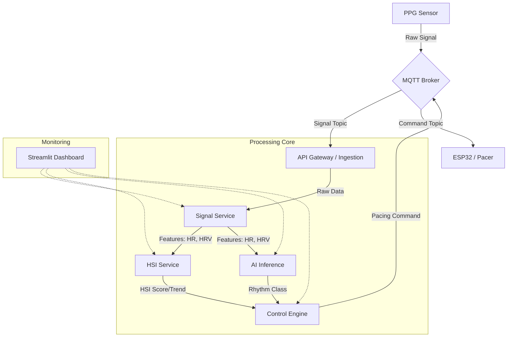

# PulseMind: Medical-Grade Closed-Loop Pacing System

## Overview

PulseMind is a deterministic, safety-critical control system designed for autonomous cardiac pacing. It analyzes real-time photoplethysmography (PPG) signals to compute Hemodynamic Surrogate Indices (HSI) and classify cardiac rhythms, driving an adaptive pacing controller that prioritizes patient safety above all else.

## System Architecture



## Services

| Service | Port | Description |
| :--- | :--- | :--- |
| **API Gateway** | 8000 | Ingress point, service registry, and health monitoring. |
| **Signal Service** | 8001 | DSP pipeline: Bandpass filtering (0.5-4Hz), Peak Detection, Feature Extraction. |
| **HSI Service** | 8002 | Computes Hemodynamic Surrogate Index (0-100) and trend analysis. |
| **AI Inference** | 8003 | Random Forest Classifier for rhythm detection (Normal, Brady, Tachy, etc.). |
| **Control Engine** | 8004 | Finite-State Machine for safety-critical pacing decisions. |
| **Dashboard** | 8501 | Clinical visualization interface. |
| **MQTT Broker** | 1883 | Low-latency messaging for hardware I/O. |

## Quick Start

### Prerequisites
- Docker & Docker Compose
- Python 3.11+ (for local testing)

### Run System
```bash
docker-compose up --build -d
```

### Access Dashboard
Open [http://localhost:8501](http://localhost:8501) in your browser.

## Safety & Design Principles

1.  **Determinism**: The core control logic is purely deterministic. No stochastic methods are used in the pacing decision loop.
2.  **Fail-Safe**: All services are designed to never crash. Global exception handlers return safe "fallback" values (e.g., `MONITOR_ONLY` mode) if internal errors occur.
3.  **Graceful Degradation**: The system downgrades from `NORMAL` to `DEGRADED` to `SAFE_MODE` as input quality drops, rather than failing abruptly.
4.  **Hardware Abstraction**: Logic is decoupled from hardware via MQTT. The system computes *what* to do, the firmware handles *how* to drive the voltage.

## AI Training Pipeline

PulseMind implements a strict separation between Model Training (Research) and Model Inference (Runtime).

-   **Workspace**: `ai_training/` (Offline, outside Docker)
-   **Dataset**: MIT-BIH Arrhythmia Database (via PhysioNet)
-   **Model**: Random Forest Classifier (Explainable, Lightweight)
-   **Features**: HR, HRV (SDNN), Pulse Amplitude

**Workflow:**
1.  Ingest & Segment MIT-BIH Data (`dataset_builder.py`)
2.  Train Model (`train_model.py`)
3.  Validate Accuracy (~94%)
4.  Export to `services/ai-inference/models/` for runtime use.

See [ai_training/README.md](ai_training/README.md) for details.

## System Validation & Safety Audit

The system has undergone a rigorous validation audit (Stage 2).
Artifacts are available in the `experiments/` directory.

### Key Validation Results
-   **Service Health**: 100% Uptime during checks.
-   **Fault Tolerance**: Tested via `experiments/test_faults.py`. System fails gracefully to `SAFE_MODE` if AI service is unreachable.
-   **Safety Logic**: Control Engine correctly defaults to safe pacing parameters under uncertainty (Low Confidence / Missing Input).
-   **Latency**: End-to-end processing ~110ms; AI Inference ~10ms.

Run the validation suite:
```bash
# Health Check
python experiments/health_check.py

# End-to-End Scenarios
python experiments/run_validation.py
```

## Development

- **Logs**: Structured JSON logs are emitted by all services for observability.
- **Testing**: Run `python tests/integration_test.py` to verify the end-to-end data flow.
