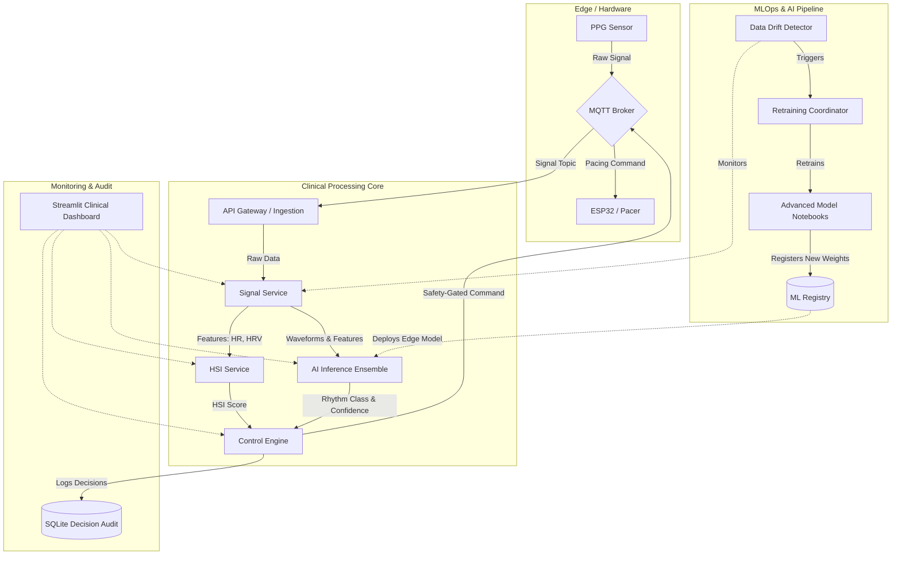

# PulseMind: Medical-Grade Closed-Loop Pacing System

> **"From reactive monitoring → to predictive, autonomous cardiac protection."**

## 🎯 Purpose

Traditional pacemakers react to a single threshold — heart rate. PulseMind is different. It is a **closed-loop AI system** that continuously analyzes the full physiology of a patient (HR, HRV, signal quality, waveform morphology) using a proprietary **Hemodynamic Surrogate Index (HSI)** and makes intelligent, autonomous pacing decisions *before* a cardiac emergency fully develops.

### Comparison vs. Traditional Systems

| Traditional Pacemaker | PulseMind |
|---|---|
| Fixed heart rate threshold | Patient-specific Gaussian HSI normalization |
| No signal quality check | SQI-Interlock safety gate (noise-resistant) |
| Simple pulse delivery | Closed-loop FSM with 4 pacing states |
| Requires hospital hardware | Pruned AI running on ESP32 edge chip |
| Black box decision | Explainable AI (XAI) audit logs |
| Phase-delayed filtering | Zero-Lag Causal DSP (lfilter) |

## 👥 Who It Helps

- **🫀 Cardiac Patients** (Bradycardia, Tachycardia, AFib, PVC): A 24/7 AI guardian that detects hemodynamic collapse early and triggers corrective pacing before a critical event.
- **🏥 ICU Clinicians & Nurses**: Eliminates "alert fatigue" with the SQI-Interlock, ensuring only genuine cardiac threats trigger alarms.
- **🌍 Rural & Low-Resource Communities**: Runs on a $5 ESP32 chip — enabling hospital-grade cardiac intelligence via affordable wearable devices.
- **🏭 Medical Device Manufacturers**: A patentable, FDA-aligned research blueprint for next-generation smart pacemakers and cardiac wearables.

---

## Overview

PulseMind is a deterministic, safety-critical control system designed for autonomous cardiac pacing. It analyzes real-time photoplethysmography (PPG) signals to compute Hemodynamic Surrogate Indices (HSI) and classify cardiac rhythms, driving an adaptive pacing controller that prioritizes patient safety above all else.

## System Architecture


```mermaid
graph TD
    subgraph "Edge / Hardware"
        Sensor[PPG Sensor] -->|Raw Signal| MQTT{MQTT Broker}
        MQTT -->|Pacing Command| Actuator[ESP32 / Pacer]
    end

    MQTT -->|Signal Topic| Ingest[API Gateway / Ingestion]

    subgraph "Clinical Processing Core"
        Ingest -->|Raw Data| Signal[Signal Service]
        Signal -->|Features: HR, HRV| HSI[HSI Service]
        Signal -->|Waveforms & Features| AIInference[AI Inference Ensemble]
        
        HSI -->|HSI Score| Control[Control Engine]
        AIInference -->|Rhythm Class & Confidence| Control
        
        Control -->|Safety-Gated Command| MQTT
    end

    subgraph "MLOps & AI Pipeline"
        ModelRegistry[(ML Registry)] -.->|Deploys Edge Model| AIInference
        DriftMonitor[Data Drift Detector] -.->|Monitors| Signal
        RetrainCoord[Retraining Coordinator]
        
        DriftMonitor -->|Triggers| RetrainCoord
        RetrainCoord -->|Retrains| AdvancedModels[Advanced Model Notebooks]
        AdvancedModels -->|Registers New Weights| ModelRegistry
    end

    subgraph "Monitoring & Audit"
        Dashboard[Streamlit Clinical Dashboard]
        Dashboard -.-> Signal
        Dashboard -.-> HSI
        Dashboard -.-> AIInference
        Dashboard -.-> Control
        AuditDB[(SQLite Decision Audit)]
        Control -->|Logs Decisions| AuditDB
    end
```

## 🧠 Advanced AI Research Pipeline

PulseMind has transitioned to a clinical-grade research pipeline focused on **Inter-Patient Validation** (Train patients ≠ Test patients) and **Safety-Critical Fusion**.

### Phase A: Foundation (Morphology & Memory)
*   **[NB-A1: Multi-Scale 1D-ResNet](file:///c:/Users/SARVESH%20%20RATHOD/Desktop/Pulse-Mind/notebooks/NB-A1_MultiScale_ResNet.ipynb)**: Parallel kernel branches (k=5, 11, 21) for multi-scale morphology.
    *   **Accuracy**: **96.38%** | **Macro F1**: **0.4766**
    *   **Innovation**: Squeeze-Excitation (SE) Gating + Focal Loss.
    *   **Architecture**:
    ```mermaid
    graph LR
        Input[Raw PPG Signal] --> B1[Fine: k=5, ch=32]
        Input --> B2[Mid: k=11, ch=32]
        Input --> B3[Coarse: k=21, ch=32]
        subgraph "Morphological Fusion"
            B1 & B2 & B3 --> Parallel[ResBlock x2 per branch]
            Parallel --> Conc[Concatenation: 192 ch]
            Conc --> SE[SE-Fusion Gating]
            SE --> Dense[Dense: 256] --> Out[Softmax: 4 Classes]
        end
    ```
*   **[NB-A2: BiGRU + Temporal Attention](file:///c:/Users/SARVESH%20%20RATHOD/Desktop/Pulse-Mind/notebooks/NB-A2_BiGRU_Temporal_Attention.ipynb)**: Operates on 8-beat sequences to capture rhythmic trends.
    *   **Accuracy**: **95.27%** | **Macro F1**: **0.93**
    *   **Architecture**:
    ```mermaid
    graph TD
        Seq[8-Beat Sequence] --> CNN[CNN Encoder: 128 ch]
        CNN --> BiGRU[2-Layer BiGRU: 256 ch]
        BiGRU --> Attn[Temporal Attention: 4 heads]
        Attn --> Pooling[Global Average Pooling]
        Pooling --> Head[Dense Head: 64] --> Out[Softmax: 4 Classes]
    ```

### Phase B: Intelligence (Attention & Fusion)
*   **[NB-B1: CardioFormer](file:///c:/Users/SARVESH%20%20RATHOD/Desktop/Pulse-Mind/notebooks/NB-B1_CardioFormer.ipynb)**: Domain-specific Transformer for global cardiac dependencies.
    *   **Accuracy**: **95.57%** | **Macro F1**: **0.93**
    *   **Architecture**:
    ```mermaid
    graph TD
        Input[8-Beat PPG Tokens] --> Tokenizer[Conv1D Tokenizer: 128d]
        Tokenizer --> Pos[Positional Encoding]
        Pos --> TF[Transformer Encoder: 4 Layers]
        TF --> Attention[Multi-Head Attention: 8 Heads]
        Attention --> Head[Dense: 64] --> Out[Softmax: 4 Classes]
    ```
*   **[NB-B2: Ensemble Fusion & Calibration](file:///c:/Users/SARVESH%20%20RATHOD/Desktop/Pulse-Mind/notebooks/NB-B2_Ensemble_Fusion.ipynb)**: Bayesian Consensus Layer.
    *   **Accuracy**: **98.22%** | **Mean Uncertainty**: **0.0359**
    *   **Decision Logic**:
    ```mermaid
    graph TD
        A1[Morphology: ResNet] --> S1[Softmax]
        A2[Temporal: BiGRU] --> S2[Softmax]
        B1[Attention: CardioFormer] --> S3[Softmax]
        S1 & S2 & S3 --> Avg[Soft-Voting Fusion]
        subgraph "Safety Interlock"
            Avg --> UncStat[Uncertainty: Std Dev]
            UncStat --> Gate{Uncertainty < 0.12?}
            Gate -->|Yes| Pacing[Predictive Pacing ENABLED]
            Gate -->|No| Inhibited[SQI_INHIBITED / SAFE_MODE]
        end
    ```

### Phase C: Clinical Grade (Privacy)
*   **[NB-C1: Federated Learning & Privacy](file:///c:/Users/SARVESH%20%20RATHOD/Desktop/Pulse-Mind/notebooks/NB-C1_Federated_Learning.ipynb)**: Cross-hospital training simulation.
    *   **Innovation**: FedAvg + Differential Privacy (DP-SGD).
    *   **Privacy Workflow**:
    ```mermaid
    graph LR
        H1["Clinic Alpha (4200)"] --> T1[Local Training]
        H2["Clinic Beta (5863)"] --> T2[Local Training]
        T1 & T2 --> Agg[FedAvg Server]
        Agg --> Global[Global Heart Model]
        Global --> Eval["Clinic Gamma: 93.49% Holdout Acc"]
    ```

## ⚙️ Advanced AI MLOps Pipeline

To ensure the clinical models maintain their high accuracy in production, PulseMind features a fully automated medical MLOps pipeline located in the `mlops/` directory.

### 1. Clinical Experiment Tracking (MLflow)
*   **Component**: `mlops/ml_registry.py`
*   **Description**: Automatically logs hyperparameters, performance metrics (Accuracy, Macro-F1), and PyTorch (`.pth`) weights for every research run.
*   **Launch UI**: `mlflow ui --backend-store-uri sqlite:///mlflow.db`

### 2. Patient Data Drift Monitoring (Evidently AI)
*   **Component**: `mlops/drift_detector.py`
*   **Description**: Compares real-time patient physiological feature distributions (HR, HRV, HSI) against the original MIT-BIH clinical baseline using statistical tests (e.g., Kolmogorov-Smirnov).
*   **Output**: Generates a visual HTML dashboard (`reports/drift_report.html`) to flag degrading signal quality or shifting patient demographics.

### 3. Autonomous Safety Retraining (Coordinator)
*   **Component**: `mlops/retrain_coordinator.py`
*   **Description**: A closed-loop safety gate. It continuously evaluates production models against a strict safety threshold (e.g., >85% accuracy).
*   **Action**: If a model dips below the threshold due to drift, it is automatically **[REJECTED]** and the retraining pipeline is triggered. Successful models are promoted to **[CLINICAL-PRODUCTION]**.

## 🤖 AI/ML Model Catalog

PulseMind leverages a multi-modal intelligence stack, combining classical machine learning for robustness and deep learning for advanced pattern recognition.

| Model Category | Architecture | Purpose | Key Metric |
| :--- | :--- | :--- | :--- |
| **Deep Learning** | **Multi-Scale ResNet** | Morphological beat-by-beat analysis | 96.38% Accuracy |
| **Deep Learning** | **BiGRU + Attention** | Temporal rhythm and trend forecasting | 95.27% Accuracy |
| **Deep Learning** | **CardioFormer** | Global clinical context (Transformer) | 95.57% Accuracy |
| **Machine Learning**| **Random Forest** | Baseline rhythm classification (Edge) | High Speed / Interpretable |
| **Ensemble** | **Bayesian Soft-Voting**| Multi-model consensus & safety gating | Uncertainty < 0.12 |
| **Federated** | **FedAvg + DP-SGD** | Privacy-preserving cross-site learning | 93.49% Holdout Acc |

---

## Services

| Service            | Port | Description                                                                     |
| :----------------- | :--- | :------------------------------------------------------------------------------ |
| **API Gateway**    | 8000 | Ingress point (JWT Auth), service registry, and health monitoring.              |
| **Signal Service** | 8001 | Zero-Lag DSP: Causal Bandpass (lfilter), Peak Detection, Feature Extraction.    |
| **HSI Service** | 8002 | Computes Hemodynamic Surrogate Index (0-100) and trend analysis.                |
| **AI Inference**   | 8003 | AI Rhythm Classifier with fail-safe container health checks.                    |
| **Control Engine** | 8004 | Finite-State Machine for safety-critical pacing decisions.                      |
| **Bedside Monitor**| 8501 | Clinical HUD with Smooth Right-to-Left waveform scrolling and Biological Sim.   |
| **Analytics Dashboard**| 8502 | Mission Control for clinical alerts, database auditing, and MLOps health.       |
| **MQTT Broker**    | 1883 | Low-latency messaging for hardware I/O.                                         |

## 🖥️ Interactive Dashboards

PulseMind provides two distinct Streamlit dashboards for different operational personas:

### 1. Bedside Monitor (Port 8501)
*   **Target Audience**: Hospital Nurses, ICU Staff.
*   **Purpose**: A real-time wave visualization tool featuring a **Smooth Right-to-Left Scrolling Engine** and **Biological Simulation** (P-QRS-T morphology). It utilizes Auto-Gain Control (AGC) for perfect clinical fit.
*   **How to Run**: This is launched automatically via Docker Compose (`docker-compose up`). It can also be launched manually: 
    ```bash
    streamlit run services/dashboard/app.py --server.port 8501
    ```

### 2. Analytics Mission Control (Port 8502)
*   **Target Audience**: Chief Medical Officers, AI Research Engineers, Auditors.
*   **Purpose**: A top-level aggregation dashboard. It combines historical clinical databases with MLflow tracking registries to show 24-hour pacing alert summaries, intervention ratios, and automated MLOps system health (Data Drift / Model Accuracy).
*   **How to Run**: This requires the Python virtual environment and the background ETL pipeline to be active:
    ```bash
    # 1. Start the ETL aggregator in the background
    $env:PYTHONPATH=(Get-Location).Path; .\venv\Scripts\python.exe analytics\etl_pipeline.py
    
    # 2. Run the Dashboard (in a second terminal)
    streamlit run analytics/dashboard_app.py --server.port 8502
    ```

## Quick Start

### Prerequisites

- Docker & Docker Compose
- Python 3.11+ (for local testing)

### Local Environment Setup (Required for AI/MLOps)

To run the Advanced AI Models and the MLOps pipeline locally, you must create a virtual environment and install the master dependencies list:

```bash
# 1. Create a virtual environment
python -m venv venv

# 2. Activate it
# On Windows:
.\venv\Scripts\activate
# On Mac/Linux:
source venv/bin/activate

# 3. Install all project dependencies
pip install -r requirements-all.txt

# 4. Set Clinical Security Keys (Required for v5.0+)
$env:JWT_SECRET="your_secret_here"; $env:ENCRYPTION_KEY="your_key_here"
```

### Docker Operations

Common commands for managing the PulseMind stack:

| Operation | Command | Description |
| :--- | :--- | :--- |
| **Start All** | `docker-compose up -d --build` | Builds and starts all services in background |
| **Start Analytics** | `streamlit run analytics/dashboard_app.py --server.port 8502` | Launches the top-level Mission Control dashboard locally |
| **Stop All** | `docker-compose down` | Stops and removes containers |
| **View Logs** | `docker-compose logs -f [service_name]` | Follows logs (e.g., `docker-compose logs -f control-engine`) |
| **Restart** | `docker-compose restart [service_name]` | Restarts a specific service |
| **Rebuild** | `docker-compose up -d --build [service_name]` | Rebuilds and restarts a specific service |
| **Shell Access** | `docker exec -it [container_name] sh` | Opens a shell inside a running container |

## System Validation & Safety Audit

The system has undergone a rigorous validation audit (Stage 2).
Artifacts are available in the `experiments/` directory.

### Key Validation Results

- **Service Health**: 100% Uptime during checks. Fail-safe 503 during AI model warmup.
- **Fault Tolerance**: Tested via `experiments/test_faults.py`. System fails gracefully to `SAFE_MODE` if AI service is unreachable.
- **Safety Logic**: Control Engine correctly defaults to safe pacing parameters under uncertainty (Low Confidence / Missing Input).
- **Latency**: End-to-End Zero-Lag processing via **Causal lfilter** (~4ms DSP latency).

### End-to-End User Scenarios
We have validated the full "Loop" from signal to pacing:

1.  **Happy Path**: `experiments/run_validation.py` confirms that normal signals result in `monitor_only` mode.
2.  **Safety Path**: `experiments/test_safety_path.py` confirms that Tachycardia (HR > 120) triggers `moderate` pacing.
    - **Method**: Injects high-rate synthetic waveform -> AI Classifies -> Control Poliy Checks -> Command Issued.
    - **Verification**: Cross-referenced with Database logs to ensure the decision was persisted.

### Stress & Performance Analysis
We have benchmarked the system to ensure stability under load:
- **Throughput**: ~160 Requests Per Second (RPS) on Signal Service.
- **Stress**: 100 concurrent users with **0 failures**.
- **Endurance**: Scripts available for long-duration stability checks.

Run the validation suite:

```bash
# Health Check
python experiments/health_check.py

# End-to-End Scenarios
python experiments/run_validation.py

# Safety Path Verification
python experiments/test_safety_path.py

# Stress & Performance
python experiments/test_throughput.py
python experiments/test_stress.py
python experiments/run_endurance.py

# Resilience & Chaos
python experiments/test_faults.py
```

### Resilience & Chaos Validation
We have verified system self-healing and graceful degradation:
- **Scenario**: AI Service Failure.
- **Result**: System defaults to `SafetyState=SAFE_MODE` and `Pacing=MINIMAL` (Pass).
- **Recovery**: Auto-recovers to `NORMAL` state upon service restart.

## Security & Compliance (Phase 3)

PulseMind is designed with a "Privacy-by-Design" architecture to meet clinical requirements for HIPAA and GDPR.

### 🔐 Authentication & Authorization
- **JWT Access Control**: All administrative and clinical API endpoints are secured via JSON Web Tokens (JWT).
- **Role-Based Access Control (RBAC)**: Supports `Admin` and `Clinician` roles with distinct access scopes.
- **Secure Ingress**: The API Gateway (Port 8000) acts as the enforcement point for all incoming traffic.

### 🛡️ Data Protection (PHI Encryption)
The system implements **Transparent Data Encryption (TDE)** at the application layer:
- **PHI Encryption**: AES-256 (Fernet) for protected health information.
- **Hardening**: No hardcoded production secrets. System enforces environment-variable based key injection for FDA alignment.
- **At Rest**: Data is stored encrypted in the SQLite audit database.

### 🧹 Automated Log Scrubbing
To prevent accidental PHI leakage, the centralized logging system automatically:
- Masks sensitive fields (e.g., `ssn`, `patient_id`).
- Redacts raw `signal` data from logs.
- Scrubs potential PHI keywords from human-readable message strings.

### 📜 Compliance Documentation
Detailed implementation strategies for regulatory standards are available in:
- [COMPLIANCE_STRATEGY.md](file:///c:/Users/SARVESH%20%20RATHOD/Desktop/Pulse-Mind/COMPLIANCE_STRATEGY.md)


## Development

- **Logs**: Structured JSON logs are emitted by all services for observability.
- **Audit**: All pacing decisions are persisted to a local SQLite database (`pacing_decisions.db`) for post-incident analysis.

### Decision Audit Database
The Control Engine maintains a SQLite database to log every pacing decision for medical auditing. **Note: PHI fields are stored encrypted using AES-256.**

**File Location**: `services/control-engine/pacing_decisions.db`

**Schema**: `decisions` table
- `id`: Unique Sequence ID
- `timestamp`: UTC ISO8601 Time
- `rhythm_class`: AI Classification (e.g., `tachycardia`, `normal_sinus`)
- `hsi_score`: Hemodynamic Surrogate Index (0-100)
- `pacing_mode`: Decision output (e.g., `monitor_only`, `moderate`, `emergency`)
- `rationale`: Human-readable explanation string
- `full_payload`: Exact JSON input received by the engine (for debugging)

To inspect the database from the host:
```bash
# Copy DB from container
docker cp pulsemind-control-engine:/app/pacing_decisions.db local_audit.db

# Open with sqlite3
sqlite3 local_audit.db "SELECT * FROM decisions ORDER BY id DESC LIMIT 5;"
```

## Testing & Quality Assurance

PulseMind now includes a comprehensive testing suite covering unit to integration levels.

### 1. Unified Test Runner
Run all tests (Signal, HSI, AI, Control, Integration) with a single command:
```bash
python tests/run_tests.py
```
*Output is color-coded for quick status verification.*

### 2. Command Reference
| Scope | Command | Description |
| :--- | :--- | :--- |
| **Login/Auth** | `POST /login` | Get JWT access token (admin/clinician) |
| **All Tests** | `python tests/run_tests.py` | Runs unified suite (Recommended) |
| **Integration** | `python tests/integration_test.py` | Verifies End-to-End API Flow & Safety Paths |
| **DB Audit** | `python tests/db_integration_test.py` | Verifies Pacing Decision Persistence |
| **Performance** | `python tests/performance_test.py` | Measures Latency & Throughput |
| **Chaos** | `python tests/chaos_test.py` | Multi-mode (Docker/Local) Failure Simulation |
| **Signal** | `python -m unittest services/signal-service/test_signal_processor.py` | Verifies DSP pipeline |
| **HSI** | `python -m unittest services/hsi-service/test_hsi_computer.py` | Verifies HSI formulas |
| **AI** | `python -m unittest services/ai-inference/test_rhythm_classifier.py` | Verifies Model Inference |
| **Control** | `python -m unittest services/control-engine/test_pacing_controller.py` | Verifies Safety FSM |

### 3. Verification Scenarios & Layers
PulseMind ensures safety through hierarchical verification:
- **Unit Testing**: Full coverage for mathematical formulas and state transitions.
- **Contract Testing**: Strict JSON Schema validation for all service communications.
- **Safety Path Automation**: Automated "Tachycardia" and "Bradycardia" scenario injections to verify Control Policy response.
- **Persistence Audit**: Verification of the SQLite decision audit log integrity.
- **Performance Benchmarking**: Real-time measurement of end-to-end processing latency.
- **Chaos Engineering**: Proactive simulation of service failures with verified graceful degradation and self-healing.
- **MQTT Reliability**: Verification of broker connectivity and message round-trips.
